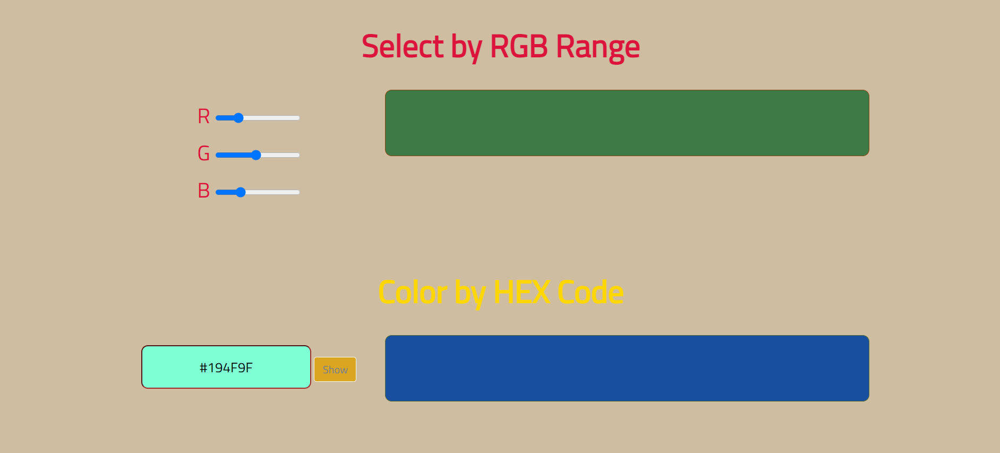

## What to build

we have to build SHADEUP APP.

## Input

## Techanology used

we have used HTML, CSS and JavaScript DOM

## What I have learned from this project

I have learned how to convert HEX to RGB color and RGB TO HEX color using javascript using dom and display output on webpage, Also designed how to display color In RGB using color selector on page, also added random color generator on page.

## Output

### HEX To RGB and RGB To Hex

### Color RGB Code by color Picker

### Random color Generotor

### Instructor

**Hitesh choudhary**
